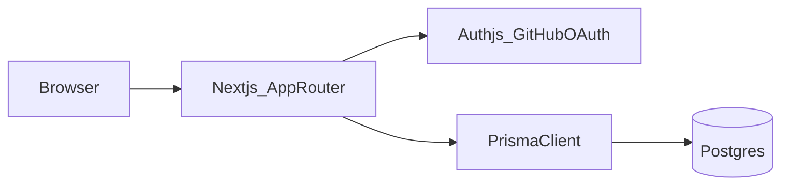

# TaskWeave

TaskWeave is a **portfolio-grade full-stack** example: multi-workspace **Kanban boards**, **role-based access control** (Owner / Member / Viewer), and **email-scoped invite links**. It is intentionally small enough to read in an afternoon, but structured like a real product (auth boundaries, server actions, Prisma schema, CI, and Dockerized Postgres).

[](https://github.com/Kauaioliveira/taskweave/actions/workflows/ci.yml?query=branch%3Amain)

**Live demo:** [https://task-weave.vercel.app](https://task-weave.vercel.app) (Vercel + managed Postgres). To run your own instance or change hosting, see **[docs/deploy-vercel.md](docs/deploy-vercel.md)**.

## Architecture



## Tech stack

- **Next.js (App Router) + TypeScript**
- **Auth.js (NextAuth v5)** with **GitHub OAuth**, **JWT sessions** (Edge-friendly middleware), and **Prisma** for user/account persistence
- **Prisma** + **PostgreSQL** (versioned migrations; `db push` still documented for quick local experiments)
- **Docker Compose** for local Postgres
- **Vitest** for a small RBAC unit test suite
- **Playwright** for a CI-only E2E path (credentials provider gated by `E2E_TEST=1`)
- **GitHub Actions** CI (lint, typecheck, unit tests, build, `prisma migrate deploy`, seed, E2E)

## Quick start

1. Install Node.js **20+** (22 recommended) and npm.
2. Start Postgres:

```bash
docker compose up -d
```

3. Configure environment variables:

```bash
cp .env.example .env
```

Fill in `DATABASE_URL` (defaults match `docker-compose.yml`), `AUTH_SECRET`, and GitHub OAuth keys (`AUTH_GITHUB_ID`, `AUTH_GITHUB_SECRET`). For production or OAuth redirects behind a public URL, set **`AUTH_URL`** (see `.env.example`).

4. Apply schema and run the dev server:

```bash
npm install
npx prisma migrate deploy
npm run dev
```

For a throwaway local DB without migration history, you can use `npx prisma db push` instead of `migrate deploy` (not recommended for production).

Open `http://localhost:3000`.

## GitHub OAuth callback URL

For local development, set the callback URL in your GitHub OAuth app to:

`http://localhost:3000/api/auth/callback/github`

In production, add your public origin as well (see [docs/deploy-vercel.md](docs/deploy-vercel.md)).

## Scripts

| Script | Purpose |
| --- | --- |
| `npm run dev` | Start Next.js (Turbopack) |
| `npm run build` | `prisma generate` + production build |
| `npm run lint` | ESLint |
| `npm run typecheck` | `tsc --noEmit` |
| `npm run test` | Vitest |
| `npm run test:e2e` | Playwright (expects `E2E_TEST=1` + seed) |
| `npm run db:push` | Sync Prisma schema without migrations (local convenience) |
| `npm run db:migrate:deploy` | Apply versioned SQL migrations (`prisma migrate deploy`) |
| `npm run db:seed` | Seed E2E users/workspace when `E2E_TEST=1` |

## Deploy notes (Vercel + managed Postgres)

See **[docs/deploy-vercel.md](docs/deploy-vercel.md)** for a full checklist (`DATABASE_URL`, `AUTH_SECRET`, `AUTH_URL`, `AUTH_TRUST_HOST`, GitHub OAuth callback, `prisma migrate deploy`, and smoke testing). **Do not** enable `E2E_TEST` in production.

## Português (curto)

Este repositório é um **projeto de portfólio** focado em mostrar **autenticação**, **autorização por workspace**, **Prisma/Postgres**, **Docker**, **testes** e **CI**.

## License

MIT
